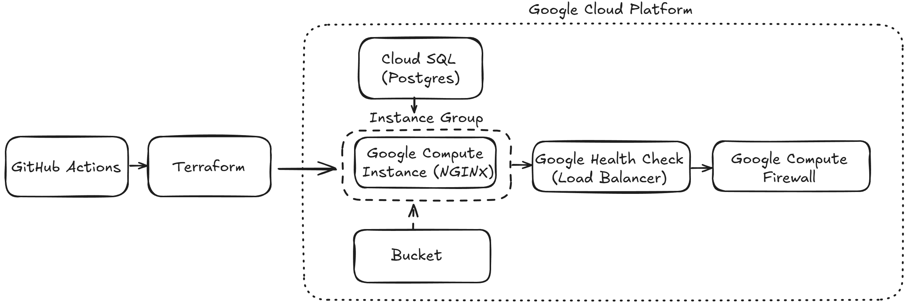
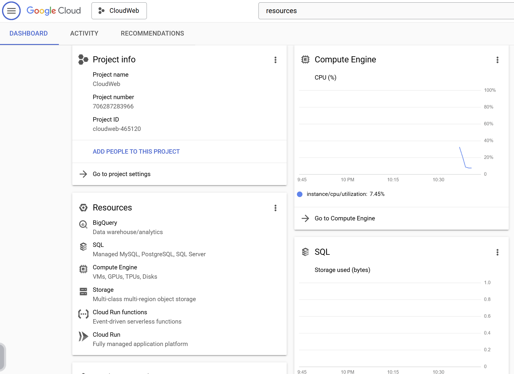
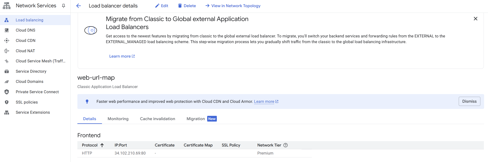
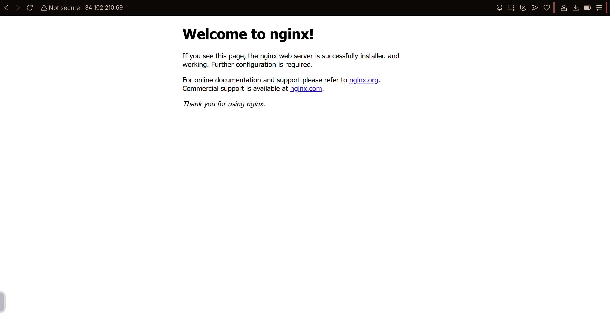

# Terraform and GCP Web Server using Github Actions
The starting point for this repo is based on my previous work creating a CI/CD pipeline for Terraform using GitHub Actions and GitHub Secrets, and can be found [here.](https://github.com/edgeloopz/gcp-cicd)

## Overview
This project creates cloud infrastructure on Google Cloud Platform using Terraform and automates the deployment with GitHub Actions using the following components:

- GCP (VM, Load Balancer, Cloud SQL, Storage) to handle all cloud components
- Terraform to use infrastructure as code
- GitHub Actions to handle Terraform
- Bash for basic testing/proof of concept
- NGINX as the web server being served

## Architecture



This is the architecture diagram showing the main components used within the Project.
This would allow me to store multiple compute instances to direct traffic with the load balancer, though I only spun up one in this project for proof of concept.

## Key Cloud Components in Terraform Code

[google_compute_instance](https://registry.terraform.io/providers/hashicorp/google/latest/docs/resources/compute_instance) - Generates a compute instance that handles the NGINX web server.

[google_sql_database_instance](https://registry.terraform.io/providers/hashicorp/google/latest/docs/resources/sql_database_instance) - This is what I used to generate a Postgres SQL Database for the web server.

[google_storage_bucket](https://registry.terraform.io/providers/hashicorp/google/6.6.0/docs/resources/storage_bucket.html)  - This is what I used to generate a bucket that could store files for the web server.

[google_compute_health_check](https://registry.terraform.io/providers/hashicorp/google/latest/docs/resources/compute_health_check) - This component is what was used to create/tune the load balancer for the cloud application.

[google_compute_instance_group](https://registry.terraform.io/providers/hashicorp/google/latest/docs/resources/compute_instance_group) - This component creates an unmanaged instance group to hold google compute instances.

[google_compute_backend_service](https://registry.terraform.io/providers/hashicorp/google/latest/docs/resources/compute_backend_service) - This component directs the traffic between the load balancer and the compute instances based on the health check.

[google_compute_url_map](https://registry.terraform.io/providers/hashicorp/google/latest/docs/resources/compute_url_map) - This component is used to route traffic to different web server endpoints based on the requested path.

[google_compute_target_http_proxy](https://registry.terraform.io/providers/hashicorp/google/latest/docs/resources/compute_target_http_proxy) - This component is used to connect the traffic from the load balancer to the url_map, handling the http request from the client.

[google_compute_global_forwarding_rule](https://registry.terraform.io/providers/hashicorp/google/latest/docs/resources/compute_global_forwarding_rule) - Takes the HTTP traffic and sends it to the proxy to handle routing to the backend.

[google_compute_firewall](https://registry.terraform.io/providers/hashicorp/google/latest/docs/resources/compute_firewall) - This creates a firewall that manages the traffic in and out of the site.

## Project Summary
In this project I wanted to replicate a system architecture that would resemble services used in GCP production environments using infrastructure as code. I also wanted to use Github Actions to create a CI/CD system that checks that the index.html code is valid as a proof of concept, validating everything with GitHub Secrets. I used all of the Terraform components listed in the Key Cloud Components section above to generate the system architecture. After enabling the Compute API and the Cloud SQL API, I was able to spin everything up in the Google Cloud environment as seen here:

### Google Cloud Dashboard Showing Generated Instances



After seeing the generated instances, I wanted to check and validate that the website was being served. I checked the Network Services section of Google Cloud to verify the ip address existed as seen here:

### Google Network Services Showing Validation of IP Address



Since I was able to see the ip address was valid, I typed the address into my browser to validate the NGINX server was running as seen here:

### NGINX Being Served to the Web


To validate the CI/CD workflow checking the code, I created a small bash script in the terraform.yml code to validate that the H1 header exists in the index.html. This is not the index.html being served by the web server, but it shows I can validate the code in the repo and then push it to overwrite the index.html in the web server. The bash script can be seen in the terraform.yml as:

```
    #Index HTML Check
    - name: Validate index.html content
      run: |
        if grep -q "<h1>Hello from NGINX</h1>" index.html; then
          echo "index.html looks passed val"
        else
          echo "index.html missing expected content"
          exit 1
        fi
```
By being able to serve the NGINX website as well as validate code using Terraform and GitHub actions, I was able to complete what I was trying to accomplish with this project!

## Challenges Faced

One big challenge I faced was after generating all of the instances. I realized that with my current code, the terraform.tfstate is handled by GitHub Actions. This means that once Terraform validates everything and is ran by GitHub Actions, there is a state desync between my local code and what is actually deployed. This led to issues in future pushes where GitHub Actions said that certain instances were already created, and Terraform destroy would not remove the instances. I tried to create a destroy workflow in Actions to resolve this, but after some research I realized that the solution would be to use a remote backend within a GCS bucket to handle the state and ensure that the state is synced whenever code is pushed. 


## Future Features

In the future, I plan to implement multiple new features such as:
- GCS focused remote backend for state management.
- Generate an actual website template and serve it to the NGINX server
- Learn about Terraform modules and implement them into the workflow.
- Add another Google Compute instance and serve two separate versions to verify the load balancer.

## Final Thoughts

This project taught me a lot about using Terraform to generate infrastructure. I learned a lot about Terraform state and how it is handled when using GitHub CI/CD as the orchestration tool.
